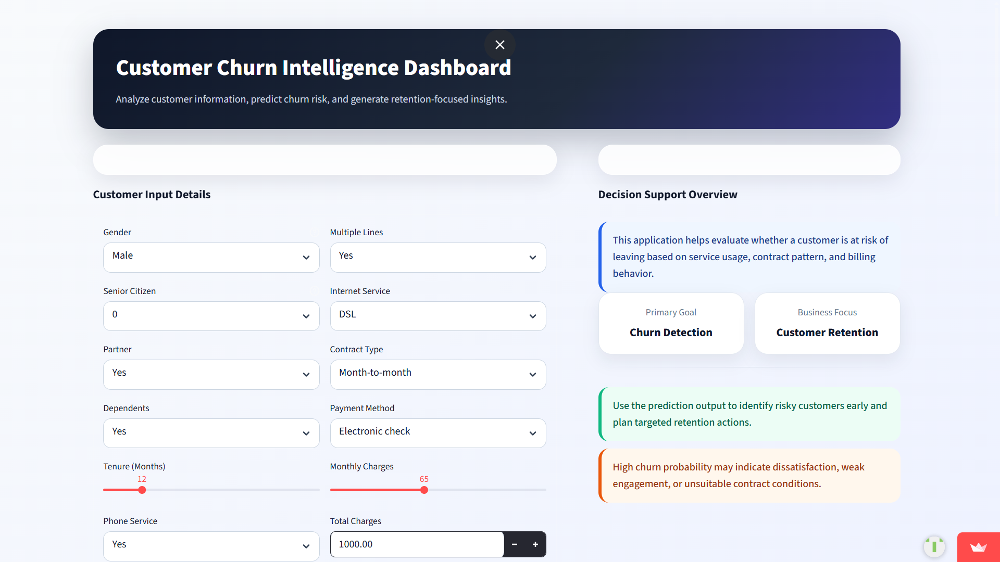
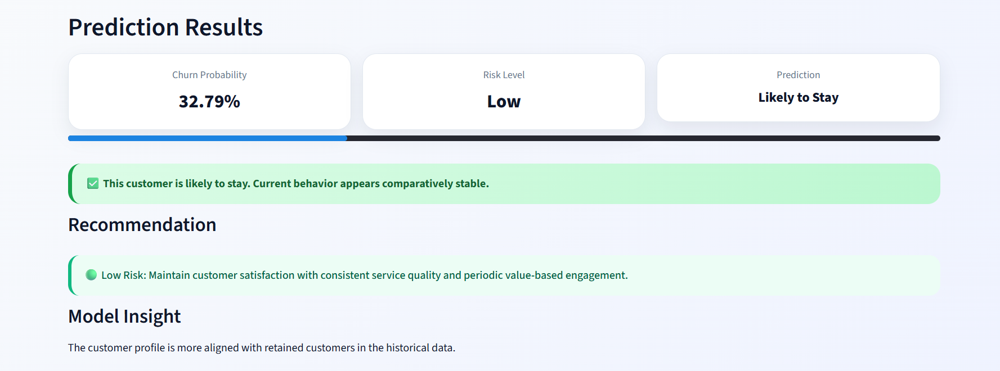

# Telecom Churn Prediction Dashboard

An end-to-end machine learning project that predicts telecom customer churn using XGBoost and presents predictions through an interactive Streamlit dashboard. The project covers the full workflow from data preprocessing and feature engineering to model evaluation, interpretation, and deployment.[https://telecom-churn-prediction-dashboard-bwcrqtqjzcmm2wbzxjsmr2.streamlit.app/]

## Project Overview

Customer churn is a critical business problem for telecom companies because losing existing customers directly affects revenue and growth. This project was built to identify customers who are likely to leave based on service usage, billing details, and contract information, helping businesses take proactive retention actions.

## Key Features

- Built a churn prediction model using XGBoost.
- Performed data cleaning, preprocessing, and feature engineering.
- Evaluated model performance using ROC-AUC, F1-score, and accuracy.
- Visualized feature importance to highlight major churn drivers.
- Developed an interactive Streamlit dashboard for real-time predictions.
- Created a complete end-to-end ML workflow from training to deployment.

  #### Screenshots

### Main Dashboard


### Prediction Results


## Tech Stack

- Python
- Pandas
- NumPy
- Scikit-learn
- XGBoost
- Streamlit
- Plotly
- Matplotlib

## Model Performance

- ROC-AUC: 0.91+
- F1-score: 0.87+
- Kaggle Competition Rank: 2168 / 4143 teams

## What the Dashboard Does

The dashboard allows users to input telecom customer details such as tenure, monthly charges, contract type, internet service, and payment method. Based on these inputs, the model predicts churn probability and helps users understand the key factors influencing customer churn.

## Workflow

1. Data collection and loading
2. Data cleaning and preprocessing
3. Feature engineering
4. Model training with XGBoost
5. Performance evaluation
6. Feature importance analysis
7. Streamlit dashboard development
8. Deployment

## Project Structure

```bash
Telecom-Churn-Prediction-Dashboard/
│── app.py
│── churn_model.pkl
│── requirements.txt
│── README.md
│── data/
│── notebooks/
│── assets/
```

## Results and Insights

The model achieved strong predictive performance with ROC-AUC above 0.91 and F1-score above 0.87. Feature importance analysis showed that customer tenure, monthly charges, contract type, and internet service were among the most influential factors in predicting churn.

